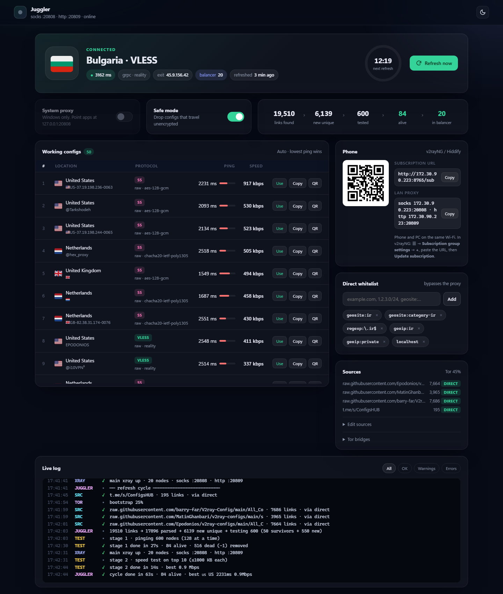

# Juggler

**A self-hosted, free VPN for censored networks.** Juggler runs [Xray-core](https://github.com/XTLS/Xray-core) on your own machine. It keeps itself supplied with the newest public configs, tests them **from your real connection**, and routes your traffic through the ones that actually work. Tor is the fallback.

No server, no domain, no account. Clone it, double-click it, and it runs.



## Why

Public V2Ray configs on Telegram and GitHub die within hours. Most of them don't work from your network at all. Juggler does the tedious part for you:

```
Telegram channels ─┐                       ┌─ stage 1: ping every candidate in parallel
GitHub aggregators ┼─► parse ─► xray -test ┤   delete every failure (-1), drop Iranian exits
your own URLs     ─┘                       └─ stage 2: speed-test the 10 best
                                                       │
           ┌───────────────────────────────────────────┘
           ▼
   live Xray balancer (top 20, health-checked, auto-failover, Tor as last resort)
   ├─ SOCKS 127.0.0.1:20808 / HTTP 127.0.0.1:20809
   ├─ Windows system proxy (one switch)
   └─ subscription URL for your phone (v2rayNG, Hiddify, …)

                               repeats every 15 minutes
```

## Features

- **Every protocol Xray can dial:** VLESS (REALITY / TLS, Vision), VMess, Trojan, Shadowsocks (AEAD and 2022), Hysteria2, WireGuard, SOCKS, HTTP. Transports: raw, ws, grpc, httpupgrade, xhttp, kcp.
- **Fast, two-stage testing.** About 600 configs are pinged in roughly 25 s. Only the top 10 get a download test, capped at about 15 s. The balancer switches to the new nodes as soon as pings are in, without waiting for the speed tests.
- **Ranked by download speed, then ping,** with flag emoji per exit country (they also render on Windows).
- **Never stuck when sources are blocked.** Each source is fetched **direct**, then through **Juggler's own proxy**, then through **Tor** (WebTunnel/obfs4 bridges you paste, plus built-in Snowflake/meek), then from the **last cached copy**.
- **Direct-route whitelist.** Iranian sites (`geosite:ir`, `.ir`, `geoip:ir`) and your LAN skip the proxy. You can add domains, IPs, CIDRs or geosite categories from the dashboard.
- **Phone support.** Your phone imports a subscription served on your Wi-Fi, with nodes renamed like `🇩🇪 DE · vless · 412ms · 3.1Mbps`.
- **Clean shutdown.** The Windows system proxy is restored on exit, on console close and after a crash. Xray and Tor never outlive the app.

## Quick start

### Windows

```powershell
git clone https://github.com/<you>/juggler.git
cd juggler
```

Then **double-click `VPN.bat`**. You can also create a desktop shortcut to it.

The first run:
1. installs `flask` and `qrcode` with pip (only Python 3.10+ is required),
2. downloads Xray, the Iran geo data and the Tor Expert Bundle into `bin/` (about 70 MB),
3. opens the dashboard at **http://localhost:8765**.

When Windows Firewall asks about `python.exe` and `xray.exe`, allow **Private networks** so your phone can connect.

### Linux / macOS

```bash
git clone https://github.com/<you>/juggler.git
cd juggler
./vpn.sh            # creates .venv on first run; add --no-browser for headless use
```

> On macOS, `setup` currently fetches x86_64 Linux/Windows builds only. Arm Macs need `bin/xray` placed manually.

### No GitHub access on the new machine?

GitHub downloads may be blocked. Either connect any VPN for the first run (setup goes through the system proxy), or copy the `bin/` folder from a machine that already ran Juggler. Everything in `bin/` is portable between machines with the same OS.

## Important: test from your real connection

Turn **other VPNs off** while Juggler is running. Juggler measures which configs work *from where your traffic leaves the machine*. If that is another VPN, the results describe that VPN, not your network.

## Using it

| Goal | How |
|---|---|
| Browser / any app | SOCKS5 `127.0.0.1:20808` or HTTP `127.0.0.1:20809` |
| All Windows apps | Dashboard → **System proxy** |
| Phone (v2rayNG) | ☰ → *Subscription group setting* → **+** → URL `http://<PC-LAN-IP>:8765/sub` → *Update subscription*. Scan the QR code on the dashboard or in the terminal. **Use the IP, not a hostname:** v2rayNG only accepts plain `http` for private IPs. |
| Phone through the PC | Set the phone's proxy to `<PC-LAN-IP>:20808` (SOCKS) or `:20809` (HTTP). |
| Pick a specific node | **Use** pins it. **Back to auto** returns to automatic lowest-ping selection. |
| Refresh now | **Refresh now** in the dashboard, or wait for the 15-minute timer. |

## Configuration

These plain-text files are created on first run. Edit them in the dashboard or with any editor.

| File | What |
|---|---|
| `sources.txt` | Telegram web previews (`https://t.me/s/<channel>`) or subscription URLs (plain or base64), one per line |
| `bridges.txt` | Tor bridges from [@GetBridgesBot](https://t.me/GetBridgesBot) or [bridges.torproject.org](https://bridges.torproject.org). WebTunnel works best in Iran. |
| `whitelist.txt` | Direct-route entries: `example.com`, `full:x.com`, `keyword:bank`, `regexp:…`, `geosite:<cat>`, `geoip:<cc>`, an IP or a CIDR. Each change is validated with `xray -test` before it is applied. |

Ports, intervals and test budgets are constants at the top of `juggler/paths.py`, `juggler/engine.py` and `juggler/tester.py`.

## Security and privacy

- **Public configs are strangers' servers.** The operator can see your IP and which sites you visit; HTTPS content stays private. Avoid banking and other sensitive logins through them, and use Tor Browser for anything that must stay anonymous.
- **Safe mode** (on by default) drops configs that send traffic over the wire unencrypted: VLESS, Trojan, SOCKS or HTTP without TLS or REALITY, and Shadowsocks `none`. Configs with `allowInsecure` are always dropped, because Xray refuses them.
- **The dashboard API is localhost-only.** Other LAN devices can reach `/sub` and the proxy ports, nothing else.
- **No telemetry.** Juggler only talks to your sources, `cloudflare.com` (connectivity and speed tests) and GitHub / torproject.org (first-run downloads).

## Troubleshooting

| Symptom | Likely cause |
|---|---|
| Very few configs alive | Normal on heavily filtered networks; survivors are kept across cycles. Add more sources. |
| Sources show `CACHE` | Every fetch path failed. Add working WebTunnel bridges so the Tor path can work. |
| Tor stuck below 100% | The built-in bridges are blocked. Paste fresh WebTunnel bridges. Bridges whose domain resolves to `10.10.34.x` are DNS-poisoned and won't work. |
| Phone can't fetch `/sub` | Same Wi-Fi? Windows network profile set to *Private*? Firewall allowed? |
| `port 8765 busy` | Juggler is already running in another window. |

## Development

```bash
python -m venv .venv && .venv/bin/pip install -r requirements.txt pytest
.venv/bin/python -m juggler.setup     # download xray / geo / tor into bin/
.venv/bin/python -m pytest -q         # the xray-backed tests run once bin/xray exists
```

```
run.py              entry point: setup → engine → Flask
juggler/links.py    share link ⇄ Xray outbound (pure, heavily tested)
juggler/sources.py  fetch cascade: direct → own proxy → Tor → disk cache
juggler/tester.py   two-stage test via one temporary xray with an HTTP inbound per node
juggler/xray.py     config builders, validation (bisection), main instance + API
juggler/engine.py   refresh loop, state, dashboard actions
juggler/tor.py      Tor + lyrebird (WebTunnel / obfs4 / Snowflake / meek)
juggler/sysproxy.py Windows system proxy with snapshot and restore
juggler/procs.py    child processes die with the app (Windows Job Object)
juggler/app.py      Flask routes, SSE log stream, QR codes, /sub
```

## Credits

- [Xray-core](https://github.com/XTLS/Xray-core) (MPL-2.0)
- [Tor](https://www.torproject.org/) and lyrebird
- [Iran-v2ray-rules](https://github.com/Chocolate4U/Iran-v2ray-rules) for the geo data
- Flag emoji on Windows: [Twemoji Country Flags](https://github.com/talkjs/country-flag-emoji-polyfill) (graphics CC-BY 4.0 © Twitter/X; packaging MIT)

Juggler is a tool for getting around censorship. Respect the laws and risks where you live.
